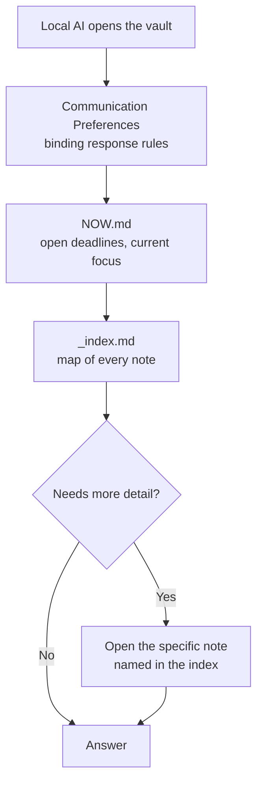

A Second Brain for Real Estate Investing: A Local-Only AI Memory System for Property Management

A plain-text knowledge base for managing rental properties. Built to be read only by AI models that run on your own computer, like LM Studio or Ollama. Nothing here is ever sent to a cloud API. That is the whole point.

## TL;DR

- Markdown files in a flat folder structure, versioned in git. Covers every property, tenant, lease, and deadline.
- Read only by local AI models. No cloud tool ever touches this vault, by rule.
- Stores everything a landlord needs: owner data, tenant data, bank details, invoices, tax figures. No redaction, because nothing ever leaves the machine.
- One operating manual (`AGENTS.md`) that any local AI reads first, so it already knows the rules.
- Two small Python scripts: one builds an index and exports, one checks the vault for problems.
- A working template, not just docs: real folders, real templates, real example notes, real scripts. Clone it, swap in your own data, done.

## The problem this solves

- Managing rentals without a management company means tracking everything yourself: emails, PDFs, spreadsheets.
- Which lease is due for its next rent increase? When is a cost statement due? What did a repair cost last time?
- AI is a good fit for this work (drafting letters, checking numbers, summarizing history), but only with the real data, and that data includes bank details and tenant information.
- Most people either avoid AI for anything sensitive, or use a cloud tool and hope for the best.
- This repo is a third option: run the AI fully offline, so the question of cloud data safety never comes up.

## The security model, precisely

"Local" removes exactly one risk: a cloud vendor receiving your data. It does not protect against device theft, malware, a bad backup, or an accidental public git push.

| Control | Protects against |
|---|---|
| Full-disk encryption on every device | Device theft or loss |
| No cloud sync of the vault folder (a NAS on your own LAN is fine) | Backup exposure |
| Git kept local, or pushed only to a private remote | Accidental public disclosure |
| OS-level access control on a shared machine or NAS | Other users on the same device |
| The `AGENTS.md` rule: never use a cloud AI tool with this vault | The one risk local-only actually solves |

None of this is exotic. It is the same baseline you would want for any folder full of bank statements.

## What this vault stores

Everything the tenancy relationship actually needs:

- Owner identity, address, and each owner's role (see `Co-Owners/`)
- Tenant name, contact details, lease terms, deposit amount and where it is held
- Bank details for rent and deposits, rent receipts, loan interest and principal payments
- Invoices, receipts, and contractor details for maintenance
- Tax-relevant figures: rent history, cost statements, depreciation, deductible expenses (see `Taxes/`)
- Correspondence history, handover protocols, and correspondence with an external building manager if there is one (see `Property Management/`)

No "restricted" tier, no redaction. Every export this vault produces stays on the same machine the data already lives on.

## Architecture

### Folder map

```
vault/
├── AGENTS.md       # Operating manual for any local AI tool (read first)
├── CLAUDE.md       # One-line pointer to AGENTS.md
├── NOW.md          # Rolling log: open deadlines, recent changes, current focus
├── _index.md       # Generated map of every note
├── _system/        # Rules for AI, note templates, maintenance scripts
├── _export/        # Generated single-file exports, for a model with no file access
├── Properties/     # One note per property or unit
├── Tenants/        # One note per tenant
├── Finance/        # Rent roll, rent receipts, bank statements, loan payments
├── Taxes/          # Depreciation, deductible expenses, tax-return prep (create on first use)
├── Maintenance/    # Repairs, contractor history, warranties, related expenses (create on first use)
├── Legal/          # Lease-law references, index-rent mechanics, rent increases (create on first use)
├── Property Management/  # Correspondence with an external building manager, if any (create on first use)
├── Co-Owners/      # Ownership shares, decision log (create on first use)
└── Archive/        # Superseded leases and closed cases (create on demand)
```

One folder level, no exceptions. This keeps every note title unique, which is what makes wikilinks (`[[Note Name]]`) work without paths.

### Frontmatter schema

```yaml
---
description: One line. What the note covers and when to read it.
created: YYYY-MM-DD
modified: YYYY-MM-DD
last_verified: YYYY-MM-DD
review: monthly | quarterly | yearly
status: draft | active | evergreen | archived
area: Properties | Tenants | Finance | Taxes | Maintenance | Legal | Property Management | Co-Owners | System
aliases: []
tags: []
---
```

- `review` feeds the linter: a note overdue for its review cadence gets flagged, catching a stale figure before it misleads anyone.
- `deadline` (optional) drives date-bound work: notice periods, statement due dates, rent-adjustment windows. The linter flags anything coming up or already overdue.
- Tenant notes add `lease_start` / `lease_end`. Maintenance notes add `contractor` and `warranty_until`. Tax notes add `tax_year`. Property Management notes add `contact`.

### The read order



Four file reads, plus whatever notes the task actually needs. No scanning the whole vault.

### Beyond chat: input for other automations

The same notes also work as input for narrower, single-purpose automations, not just a chat agent:

- Draft the annual cost statement (Nebenkostenabrechnung): reads `Properties/`, `Tenants/`, `Finance/`
- Calculate an index-linked rent increase: reads `Tenants/`, `Legal/`, `Finance/`
- Monitor rent receipts and loan payments: reads `Finance/`
- Track repairs and expenses: reads `Maintenance/`, `Finance/`
- Prepare tax figures: reads `Taxes/`, `Finance/`
- Track correspondence with a building manager: reads `Property Management/`

`AGENTS.md` section 8 has the full list.

## Getting started

1. Clone or download this repository.
2. Install [LM Studio](https://lmstudio.ai) (or Ollama, or any local model runner) and a model that runs fully offline, Gemma is a good default. Confirm it works with no network connection.
3. Point your local agent's file access at this folder, or, for a plain chat UI with no file access, run `python3 _system/build_export.py` and paste `_export/PORTFOLIO.md` into the system prompt.
4. Replace the example notes in `Properties/`, `Tenants/`, and `Finance/` with your own portfolio.
5. Update `_index.md` and the notice at the top of `AGENTS.md` to describe your own setup, then delete both notices.
6. Run `python3 _system/lint.py` and fix what it flags.

Runs on a stock Python 3 install, no `pip install` needed.

## Automation

**`lint.py`**: checks the vault before every editing session:
- Frontmatter completeness
- Broken wikilinks
- Folder-depth violations
- Overdue reviews
- Upcoming or passed deadlines
- Stale entries in `NOW.md`
- Open, unconfirmed assumptions (`#annahme`)

**`build_export.py`**: rebuilds the `_index.md` catalog and both exports (`PORTFOLIO.md`, `PORTFOLIO-full.md`).

Both scripts share `vaultlib.py`, a small helper with no dependencies.

## Maintenance workflow

| Cadence | Action |
|---|---|
| After every editing session | Update `NOW.md`, bump `modified`, run the linter |
| When notes are added or renamed | Rebuild the catalog and exports |
| Monthly | Run the linter, prune `NOW.md`, re-verify due notes, rebuild exports |
| Before a chat UI with no file access | Regenerate the export |

## Tech stack

| Layer | Choice | Why |
|---|---|---|
| Storage | Markdown + YAML frontmatter | Simple, diffable, human-readable |
| AI runtime | Local model runner (LM Studio, Ollama) with a model like Gemma | Fully offline |
| Editor | Obsidian, core plugins only | Wikilinks and graph view for free, no plugin dependency |
| Linking | Title-based wikilinks | Notes can move without breaking links |
| Scripting | Python 3, standard library only | No dependencies, runs anywhere |
| Version control | Git, local or private remote only | Full history, never a public remote for real data |
| Sync | A NAS on your own LAN, or an encrypted sync tool | No consumer cloud drive involved |

## Why this is worth building

Running rentals without a management company means being the accountant, the correspondent, and the record keeper. AI helps with that work, but only if it can be trusted with the data. Running everything offline removes that trust problem by design, not by policy.

---

This document, and the example notes in this repository, contain no real personal, tenant, or financial data. Every value is fictional. Replace it with your own before using this vault for real.
